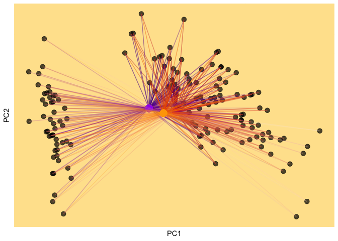

Takes time (minutes) because I calculated everything in the app. To be
fixed later.

More explanations to come.

<br>

<iframe width="1500" height="1000" scrolling="no" frameborder="no" src="https://herewego.shinyapps.io/kmeans/">
</iframe>
<br>

The K-means algorithm is one of the most popular clustering algorithms.
In this post, we will step through and write the K-means algorithm by
hand.

The broad steps of K-means are as follows:

-   Step 1. Choose the K number of clusters.

-   Step 2. Split the data randomly into K groups.

-   Step 3. Iterate until the cluster assignments stop changing:
    -   1.  For each of the K clusters, compute the cluster centroid.
            The kth cluster centroid is the vector of the p feature
            means for the observations in the kth cluster.

    -   1.  Assign each observation to the cluster whose centroid is the
            closest.

We load the necessary packages into our environment.

``` r
library(ggplot2)
library(tidyverse)
library(gganimate)
library(ggnewscale)
library(xfun)
```

We also load and format the data we want to use. In this post we will
use the well known Iris dataset because it is accessible to everyone.

``` r
data(iris)
# select the numeric data
iris_data <- iris %>% 
  mutate(Species = make.names(Species, unique = T)) %>% 
  column_to_rownames("Species") 
```

The Iris dataset has four columns, which is hard to visualize because we
can’t plot four dimensional plots. We would have to choose two columns
of interest and plot those.

``` r
head(iris_data)
```

    ##          Sepal.Length Sepal.Width Petal.Length Petal.Width
    ## setosa            5.1         3.5          1.4         0.2
    ## setosa.1          4.9         3.0          1.4         0.2
    ## setosa.2          4.7         3.2          1.3         0.2
    ## setosa.3          4.6         3.1          1.5         0.2
    ## setosa.4          5.0         3.6          1.4         0.2
    ## setosa.5          5.4         3.9          1.7         0.4

Instead of plotting and conducting K-means on the raw data, we will plot
and use the first two principal components of a principal components
analysis. Principal components analysis allows us to visualize the
information contained in a high dimensional dataset in fewer dimensions.

The principal components will be our input to K-means.

``` r
data <- pcs
```

We decide on the K, or how many clusters we will consider. As well as
the number of iterations of the algorithm.

``` r
K = 3 # we set the number of clusters to two for simplicity
it = 10
cluster_names <- numbers_to_words(1:K) # convert to english word clusters
```

We first randomly assign cluster labels to each data point.

``` r
set.seed(10)
# Randomly assign a number, from 1 to K, to each of the observations. 

# Here I sampled from One or Two (because K equals two), for each data point in data.
rand_idx <- sample(cluster_names, nrow(data), replace=TRUE)
# I add a column to the data called cluster_id with the randomly assigned groups. 
data$cluster_id <- rand_idx
```

Then we calculate the cluster centroids. We group all data points from
the same cluster, and we take the mean.

``` r
cluster_centroids <- data %>% 
 group_by(cluster_id) %>%
   summarise_all(~mean(., na.rm=TRUE)) %>%
 column_to_rownames("cluster_id")
```

Then for each cluster centroid that we calculated, we find the distance
to each data point. We will use the squared euclidean distance as our
distance metric here. The squared euclidean distance won’t get stuck in
local minima as much as euclidean distance will.

``` r
sq_euclidean_dist <- function(x1, x2) {
  sum((x1 - x2) ^ 2)
}
```

``` r
for(i in 1:nrow(cluster_centroids)) {
    newname_dist = paste0("distance_", rownames(cluster_centroids[i,]))

    current_distance <- apply(data %>% select(starts_with("PC")), 1, function(y) {sq_euclidean_dist(as.numeric(y),
                                                      as.numeric(cluster_centroids[i,]))})
    data[[newname_dist]] <- current_distance
}
```

Here, we add the cluster centroid information to the data.frame, data,
so we can plot the cluster centroids using ggplot2.

``` r
for(i in 1:nrow(cluster_centroids)) {
  newname_PC1 = paste0("centroid", rownames(cluster_centroids[i,]), "_PC1")
  newname_PC2 = paste0("centroid", rownames(cluster_centroids[i,]), "_PC2")
  
  data[[newname_PC1]] <- cluster_centroids$PC1[i]
  data[[newname_PC2]] <- cluster_centroids$PC2[i]
}
```

We plot our data and the random cluster assignments

``` r
background = "#FFE39B"
current_clust <- ggplot(data, aes(PC1, PC2)) + 
  geom_point(size = 3, alpha = 0.7, color = "black") +
  theme(panel.background = element_rect(fill = background, color = background), 
          panel.grid.major = element_line(color = background),
          panel.grid.minor = element_line(color = background),
          axis.text.x=element_blank(),
          axis.ticks.x=element_blank(),
          axis.text.y=element_blank(),
          axis.ticks.y=element_blank()) 

ggsci_cols <- c("red", "purple", "orange", "brown", "indigo")

for(k in 1:K){
  color = ggsci_cols[k]
  cluster_name <- numbers_to_words(k)
  newname_PC1 = paste0("centroid", cluster_name, "_PC1")
  newname_PC2 = paste0("centroid", cluster_name, "_PC2")
  newname_dist = paste0("distance_", cluster_name)

  current_clust <- current_clust + 
      geom_segment(aes(x = !!sym(newname_PC1), y = !!sym(newname_PC2), xend = PC1, yend = PC2,
                 color = -!!sym(newname_dist), alpha = -log(!!sym(newname_dist)))) + 
    ggsci::scale_color_material(color) +
    geom_point(aes(!!sym(newname_PC1), y = !!sym(newname_PC2), size=2), color = color) +
    new_scale_color() 
}

current_clust <- current_clust +
  theme(legend.position = "none")

current_clust
```



Great. Now we iterate the K-means algorithm 10 times.

``` r
# make one long df 
total_data <- c()
current_data <- data

for(k in 1:it){
  
  #strip data 
  current_data <- current_data %>% 
    select(PC1, PC2, PC3, PC4, cluster_id)  
  
  # calculate cluster centroids based on cluster identities 
  cluster_centroids <- current_data %>% 
   group_by(cluster_id) %>%
     summarise_all(~mean(., na.rm=TRUE)) %>%
   column_to_rownames("cluster_id")
  
  for(i in 1:nrow(cluster_centroids)) {
      newname_dist = paste0("distance_", rownames(cluster_centroids[i,]))
  
      current_distance <- apply(current_data %>% select(starts_with("PC")), 1, function(y) {sq_euclidean_dist(as.numeric(y),
                                                        as.numeric(cluster_centroids[i,]))})
      current_data[[newname_dist]] <- current_distance
  }
  
  
  for(i in 1:nrow(cluster_centroids)) {
    newname_PC1 = paste0("centroid", rownames(cluster_centroids[i,]), "_PC1")
    newname_PC2 = paste0("centroid", rownames(cluster_centroids[i,]), "_PC2")
    
    current_data[[newname_PC1]] <- cluster_centroids$PC1[i]
    current_data[[newname_PC2]] <- cluster_centroids$PC2[i]
  }
    
  current_data$iteration <- k
  
  total_data <- rbind(total_data, current_data)
  
  # calculate new centroids
  distances <- current_data %>% 
    select(starts_with("distance")) %>% 
    select(order(colnames(.)))
  
  idx <- apply(distances, 1, function(x){which.min(x)})
  idx <-  numbers_to_words(idx)

  current_data$cluster_id <- idx
}
```

The output of this data is used in the gif at the top of the post.
